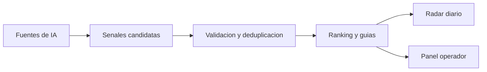

# AI Radar

AI Radar es un sistema para seguir cambios importantes en inteligencia artificial.

El objetivo es construir un sistema que encuentre noticias, papers, lanzamientos y cambios importantes en inteligencia artificial; los convierta en senales verificables; elimine duplicados; priorice lo realmente nuevo; y genere una guia practica para decidir que vale la pena probar.

Este repositorio empieza de forma intencionalmente minima: un README con la vision del producto, las decisiones iniciales y el mapa tecnico del sistema.

## Producto objetivo

AI Radar debe terminar con dos modos principales:

- Modo lector: radar diario de senales de IA, ranking, detalle de evidencia y guia de accion.
- Modo operador: fuentes, corridas de ingesta, decisiones de calidad, items pendientes, logs y estado de automatizacion.

La aplicacion debe funcionar desde computador y celular.

## Arquitectura objetivo

El sistema final debe tener estas piezas:

- Fuentes editoriales: newsletters, blogs tecnicos, repos, papers, changelogs, benchmarks y comunicados oficiales.
- Admin editorial: Notion como lugar para administrar fuentes, temas, prioridades y estado de publicacion.
- Ingesta: procesos que buscan informacion reciente, guardan resultados estructurados por fecha y dejan trazabilidad.
- Calidad de datos: validacion, deduplicacion, agrupacion de noticias relacionadas y decision de estado.
- Backend: servicios para consultar senales, detalle, guias, corridas y operaciones controladas.
- Base de datos: Supabase Postgres para persistir senales confiables, runs, fuentes y decisiones.
- Frontend: web app dinamica para explorar el radar, filtrar resultados, revisar evidencia y ver guias.
- Operacion: logs, costos, secretos, permisos y reportes.
- Deploy: preview y produccion en Vercel cuando el sistema ya tenga validacion local.
- Demo final: video o presentacion tecnica del sistema funcionando.

## Stack objetivo

- JavaScript para la logica del producto.
- React para la web app.
- Supabase para datos.
- Vercel para publicar la aplicacion.
- Notion para administrar fuentes editoriales.
- Codex para construir, operar y automatizar el flujo de trabajo.
- HyperFrames o Remotion para el demo final.
